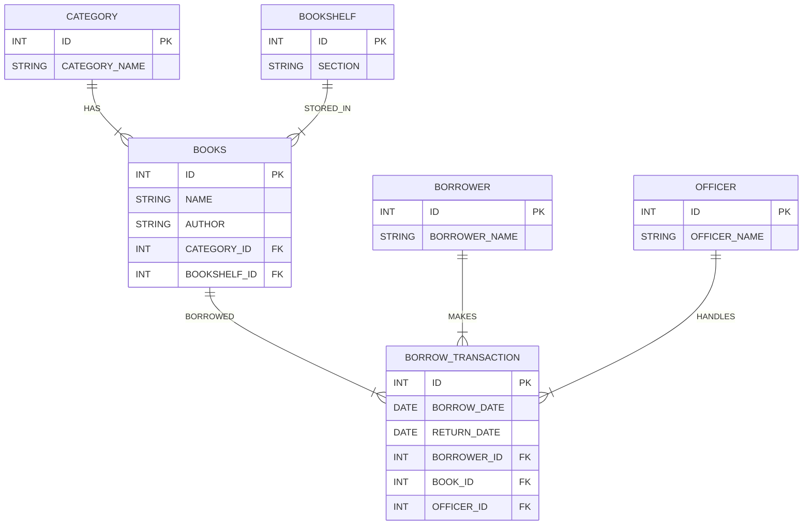

# library

```mermaid
erDiagram

BOOKS {
    INT ID PK
    STRING NAME
    STRING AUTHOR
    INT CATEGORY_ID FK
    INT BOOKSHELF_ID FK
}

CATEGORY {
    INT ID PK
    STRING CATEGORY_NAME
}

BOOKSHELF{
    INT ID PK
    STRING SECTION
}

OFFICER {
    INT ID PK
    STRING OFFICER_NAME
}

BORROWER {
    INT ID PK
    STRING BORROWER_NAME
}

BORROW_TRANSACTION {
    INT ID PK
    DATE BORROW_DATE
    DATE RETURN_DATE
    INT BORROWER_ID FK
    INT BOOK_ID FK
    INT OFFICER_ID FK
}

CATEGORY ||--|{ BOOKS : HAS
BOOKSHELF ||--|{ BOOKS : STORED_IN
BOOKS ||--|{ BORROW_TRANSACTION : BORROWED
BORROWER ||--|{ BORROW_TRANSACTION : MAKES
OFFICER ||--|{ BORROW_TRANSACTION : HANDLES


```
<!-- 1 KATEGORI BISA BANYAK BUKU -->
<!-- 1 BUKU DI SATU RAK -->
