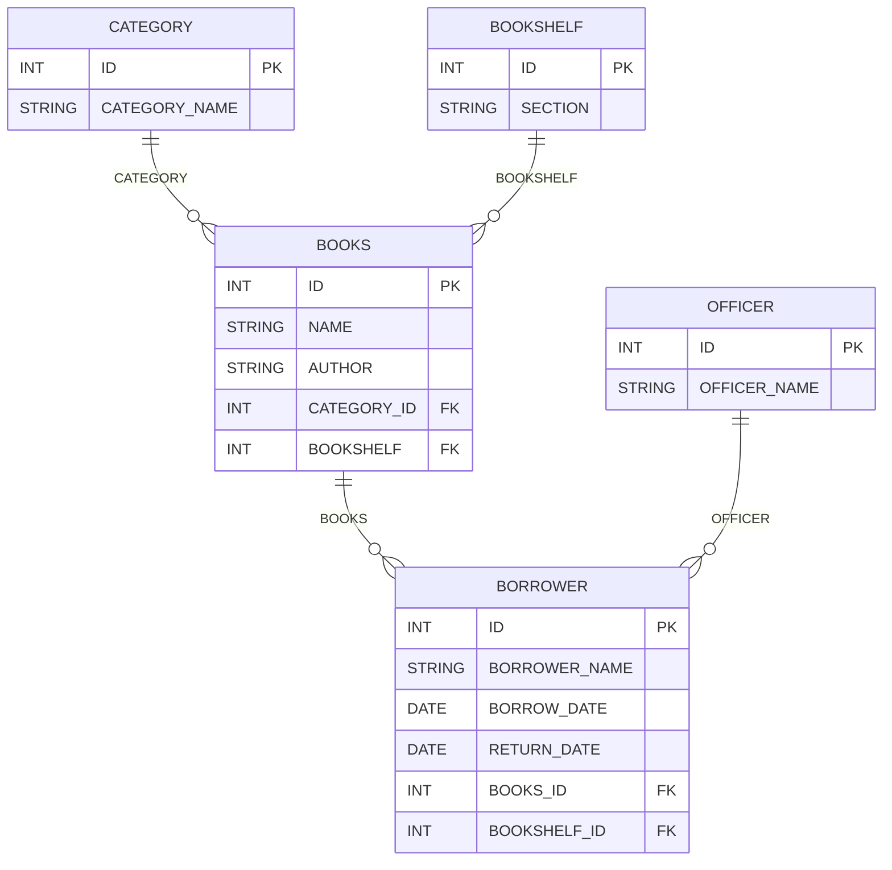

# library

```mermaid
erDiagram

BOOKS {
    INT ID PK
    STRING NAME
    STRING AUTHOR
    INT CATEGORY_ID FK
    INT BOOKSHELF FK
}

CATEGORY {
    INT ID PK
    STRING CATEGORY_NAME
}

BOOKSHELF{
    INT ID PK
    STRING SECTION
}

OFFICER {
    INT ID PK
    STRING OFFICER_NAME
}

BORROWER {
    INT ID PK
    STRING BORROWER_NAME
    DATE BORROW_DATE
    DATE RETURN_DATE
    INT BOOKS_ID FK
    INT BOOKSHELF_ID FK
}


CATEGORY ||--o{ BOOKS : CATEGORY
BOOKSHELF ||--o{ BOOKS :BOOKSHELF
BOOKS ||--o{ BORROWER : BOOKS
OFFICER ||--o{ BORROWER : OFFICER

```
<!-- 1 KATEGORI BISA BANYAK BUKU -->

